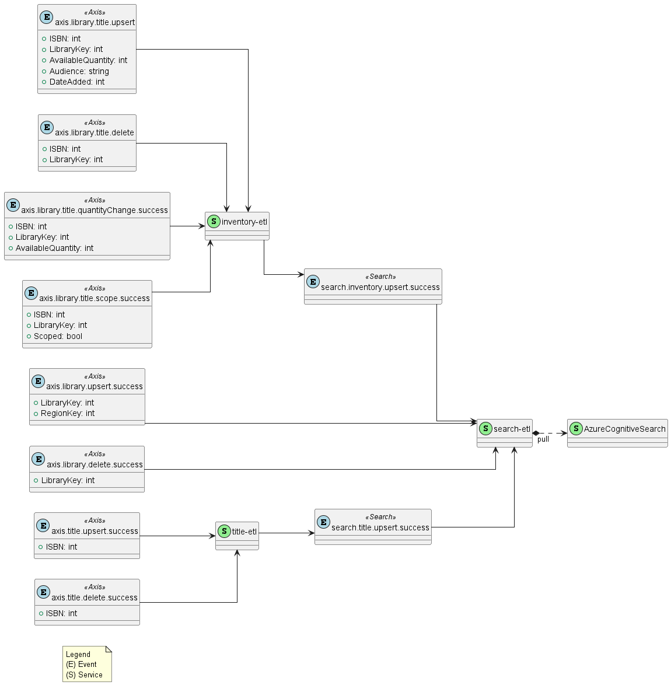

# Events

This document serves to describe how events will flow, and the schema of each event. For documentation on how
each event is consumed, please refer to the relevant services which consume them (linked in the schema section of each
service).

[[_TOC_]]

# Event Schema

## Conventions

To make Events in the system easier to think and talk about, in terms of how they are propagated, and how they might be
consumed, there are some conventions to follow.

**Topics**

Topics should be created using the pattern `<entity>[.<field>].<verb>.[success|error]` where:

* `entity` is the object or service which the event relates to (e.g. `inventory`, `title`, `omni`). Note that this is
  not necessarily the same as `Origin` (see Headers below).
* `field` is optional
* `verb` should be descriptively past-tense (e.g. if an inventory item was updated, `inventory.updated` not
  `inventory.update`) to avoid implications of event commands.
* `[success|error]` to allow for explicit subscription to relevant events. Errors may be picked up by some services
  (e.g. for logging or retries, etc) while other services may only be interested in successful events (e.g. search-etl
  would not care about a *failed* title update).

**Headers**

All events should carry the following headers

| Header        | Type                         | Reason                                                                              |
|---------------|------------------------------|-------------------------------------------------------------------------------------|
| CorrelationID | UUID                         | Tracks the relationship between different events in the same chain.                 |
| Origin        | string                       | Tracks the service which spawned the event.                                         |                                            
| Timestamp     | int (unix Timestamp)         | Tracks the sequencing (and in some cases applicability) of events.                  |
| Type          | enum [notice/delta/document] | Describes the kind of data in the message (see [Event Patterns](events/patterns.md) |

Any event generated by a subscriber which publishes subsequent events should forward the `CorrelationID` of the
originally consumed event.

The `Type` header should be used to provide context on how to handle the message body.

The `Origin` header should be used to provide information on where a callback may be made. It should be a namespaced
path
consisting of a service and entity. Example:
> The `inventory-service` service publishes an `inventory.update` event:
> ```
> Topic: inventory.update
> Headers:
>   CorrelationID: a4147af9-766e-4b35-9230-b87a0402a94b
>   Origin: inventory-service/inventory
>   Timestamp: 1682627510
>   Type: notice
> Body:
>   ID: 1234
> ```
> Which is consumed by the `search-etl` service. `search-etl` will (through one of its data providers) do an HTTP call:
> ```
> GET http://inventory-service/inventory/1234
> ```

`notice` events should be preferred, except where it is not possible to run a retrieval callback (e.g. events from
Axis or LIUD).

`document` events should be preferred when a `notice` event is not possible due to a lack of retrieval endpoints, except
where a complete document is not available by the publisher of an event

`delta` events may be used, where `notice` and `document` events are not possible, provided sufficient data is provided
for a subscriber to work with.

Example:
> A scope event may come from LIUD, but scoping data does not include quantity data, and so we cannot provide a whole
> document which represents an inventory item. Therefore, we would publish a `delta` event, with LibraryKey, BTKey and
> the scope state.
>
> The same applies for a quantity update, insofar as we cannot provide a whole document. Quantity updates do not include
> scope data. So, again, we would publish a `delta` event, this time with LibraryKey, BTKey and the Quantity data.

Do note that `document` events may be treated as `delta` events by any subscriber so motivated.

`delta` events may also be treated as `document` events by subscribers, but due to the potential variability of the
message body, this is not recommended.

See also:

* [Event Patterns](events/patterns.md) (for detail on pros and cons around `notice` vs `delta` vs `document`)
* [Infrastructure](infrastructure.md) (for detail on service registration and discovery)

# Event Catalogue

## Library Budget Update

| Topic                               | Type    | Subscribers                                                                                                 | Publishers                             |
|-------------------------------------|---------|-------------------------------------------------------------------------------------------------------------|----------------------------------------|
| availability.access.updated.success | `delta` | [Inventory Access Service](services/inventory-access-service/endpoints.md#availabilityaccessupdatedsuccess) | [Axis Poller](services/axis-poller.md) |

**Body Schema**
```yaml
ClientID: int
InventoryRef: string
Blocked: bool
```

## Axis Inventory Checkout

| Topic                         | Type     | Subscribers                                                                      | Publishers                                                 |
|-------------------------------|----------|----------------------------------------------------------------------------------|------------------------------------------------------------|
| availability.checkout.success | `notice` | [Inventory SERVICE](services/inventory-service/endpoints.md#availabilitycheckoutsuccess) | Axis360, VendorAPI, [Axis Poller](services/axis-poller.md) | 

**Body Schema**

```yaml
ISBN: int
LibraryKey: int
```

## Axis Inventory Return

| Topic                       | Type     | Subscribers                                | Publishers                                                 |
|-----------------------------|----------|--------------------------------------------|------------------------------------------------------------|
| availability.return.success | `notice` | [Inventory SERVICE](services/inventory-service.md) | Axis360, VendorAPI, [Axis Poller](services/axis-poller.md) | 

**Body Schema**

```yaml
ISBN: int
LibraryKey: int
```

## Axis Inventory Delete

| Topic                        | Type     | Subscribers                                | Publishers |
|------------------------------|----------|--------------------------------------------|------------|
| availability.deleted.success | `notice` | [Inventory SERVICE](services/inventory-service.md) | TBD        | 

**Body Schema**

```yaml
ISBN: int
LibraryKey: int
```

## Axis Inventory Quantity Change

| Topic                                 | Type    | Subscribers                                | Publishers                             |
|---------------------------------------|---------|--------------------------------------------|----------------------------------------|
| availability.quantity.changed.success | `delta` | [Inventory SERVICE](services/inventory-service.md) | [Axis Poller](services/axis-poller.md) | 

**Body Schema**

```yaml
ISBN: int
LibraryKey: int
AvailableQuantity: int
```

## Axis Inventory Scope Change

| Topic                              | Type    | Subscribers                                | Publishers |
|------------------------------------|---------|--------------------------------------------|------------|
| availability.scope.changed.success | `delta` | [Inventory SERVICE](services/inventory-service.md) | TBD        | 

**Body Schema**

```yaml
ISBN: int
LibraryKey: int
Scoped: bool
```

## Axis Inventory Upsert

| Topic                        | Type    | Subscribers                                | Publishers |
|------------------------------|---------|--------------------------------------------|------------|
| availability.updated.success | `delta` | [Inventory SERVICE](services/inventory-service.md) | TBD        | 

**Body Schema**

```yaml
ISBN: int
LibraryKey: int
AvailableQuantity: int
Audience: string
DateAdded: int
```

## Axis Library Delete

| Topic                        | Type     | Subscribers                                | Publishers |
|------------------------------|----------|--------------------------------------------|------------|
| availability.deleted.success | `notice` | [Inventory SERVICE](services/inventory-service.md) | TBD        | 

**Body Schema**

```yaml
LibraryKey: int
```

## Axis Title Delete

| Topic                | Type     | Subscribers                        | Publishers |
|----------------------|----------|------------------------------------|------------|
| omni.deleted.success | `notice` | [Title ETL](services/title-etl.md) | TBD        | 

**Body Schema**

```yaml
  ISBN: int
```

## Axis Title Upsert

| Topic                | Type       | Subscribers                        | Publishers |
|----------------------|------------|------------------------------------|------------|
| omni.updated.success | `document` | [Title ETL](services/title-etl.md) | TBD        | 

**Body Schema**

```yaml
ISBN: int
  ...etc...
```

## Search Inventory Update

| Topic                     | Type     | Subscribers                          | Publishers                                                                                                                                                                                                                                                                                                |
|---------------------------|----------|--------------------------------------|-----------------------------------------------------------------------------------------------------------------------------------------------------------------------------------------------------------------------------------------------------------------------------------------------------------|
| inventory.updated.success | `notice` | [Search ETL](services/search-etl.md) | [Inventory SERVICE - Increment](services/inventory-service/domain.md#increment)<br/>[Inventory SERVICE - Quantity Change](services/inventory-service/domain.md#quantity-change)<br/>[Inventory SERVICE - Scope](services/inventory-service/domain.md#scope)<br/>[Inventory SERVICE - Upsert](services/inventory-service/domain.md#upsert) |

**Body Schema**

```yaml
  ID: int
```

## Search Title Update

| Topic                 | Type     | Subscribers                          | Publishers                                                |
|-----------------------|----------|--------------------------------------|-----------------------------------------------------------|
| title.updated.success | `notice` | [Search ETL](services/search-etl.md) | [Title ETL - Upsert](services/title-etl/domain.md#upsert) | 

**Body Schema**

```yaml
  ID: int
```

# Event Stream

This diagram shows the overall event stream.



# Rationale

In order to keep the index up to date, we must be able to handle state changes for inventory and titles.

The following state changes have been identified.

* [Inventory changes:](#inventory-changes)
    * A library purchases a title
    * A library over-rides the title's audience key
    * A library deletes a title
    * A title is checked in
    * A title is checked out
    * A title is scoped
    * A title is de-scoped
* [Title Changes:](#title-changes)
    * A title is created
    * A title is updated
    * A title is deleted
* [Library Changes:](#library-changes)
    * A library is created
    * A library is updated
    * A library is deleted

## Inventory changes

Inventory changes can be grouped into library-driven changes, or availability-driven changes:

### Library Driven:

* A library purchases a title
* A library over-rides the title's audience key
* A library deletes a title

### Availability Driven

* A title is checked in
* A title is checked out
* A title is scoped
* A title is de-scoped

The library driven changes can be summarised as upserting a title (either adding the title, or over-riding audience),
and deleting a title.

Availability driven changes can be summarised as changing quantity and changing scope.

### Derived Events

This gives us the following events:

* inventory upsert
* inventory delete
* inventory quantity change
* inventory scope change

## Library Changes

## Title Changes
