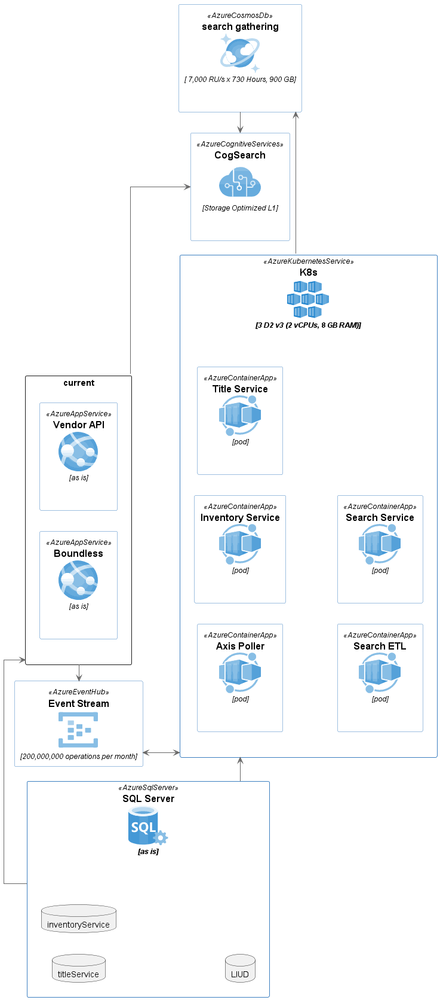

# Infrastructure
These are the infrastructure pieces required.

## Azure Cognitive Search

Azure Cognitive Search will be used to store searchable data for titles and their relevant inventories.
It will be consumed by the search service to retrieve title results.

[Azure Cognitive Search Docs](https://learn.microsoft.com/en-us/rest/api/searchservice/)

## SQL Server
SQL Server will be used to persist relational data.

### LIUD
The existing database used by Boundless and VendorAPI

### InventoryService
A new database for the [Inventory microservice](services/inventory-service.md)

### TitleService
A new database for the [Title microservice](services/title-etl.md)

## Azure CosmosDB

Cosmos is a document store which will be used as the ingestion source for [Azure Cognitive Search](#azure-cognitive-search)

[Azure CosmosDB documentation](https://learn.microsoft.com/en-us/azure/cosmos-db/)

## Azure Event Hubs
(see [Azure EventHubs documentation](https://learn.microsoft.com/en-us/azure/event-hubs/event-hubs-about))

Event Hubs will be used to handle event messaging throughout the ecosystem.

## Kubernetes

Kubernetes will be used to host the services, which themselves will be packaged as Docker containers.

[Kubernetes Documentation]() and [Docker Documentation]())

## Diagram

