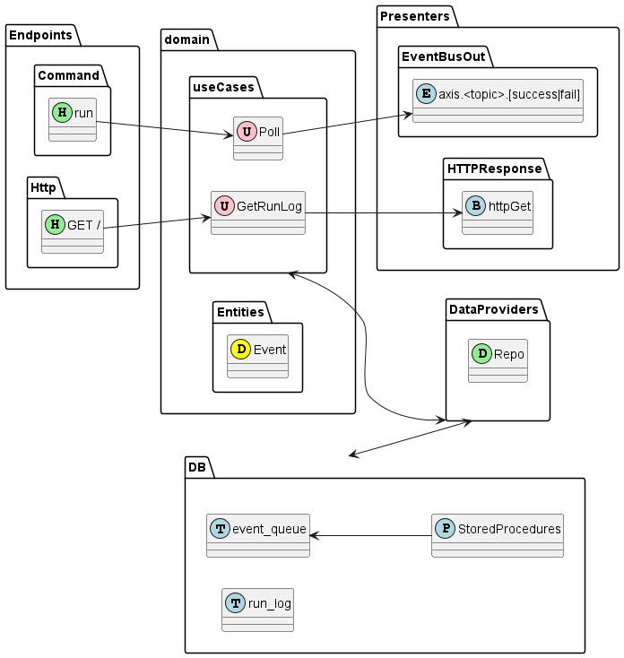
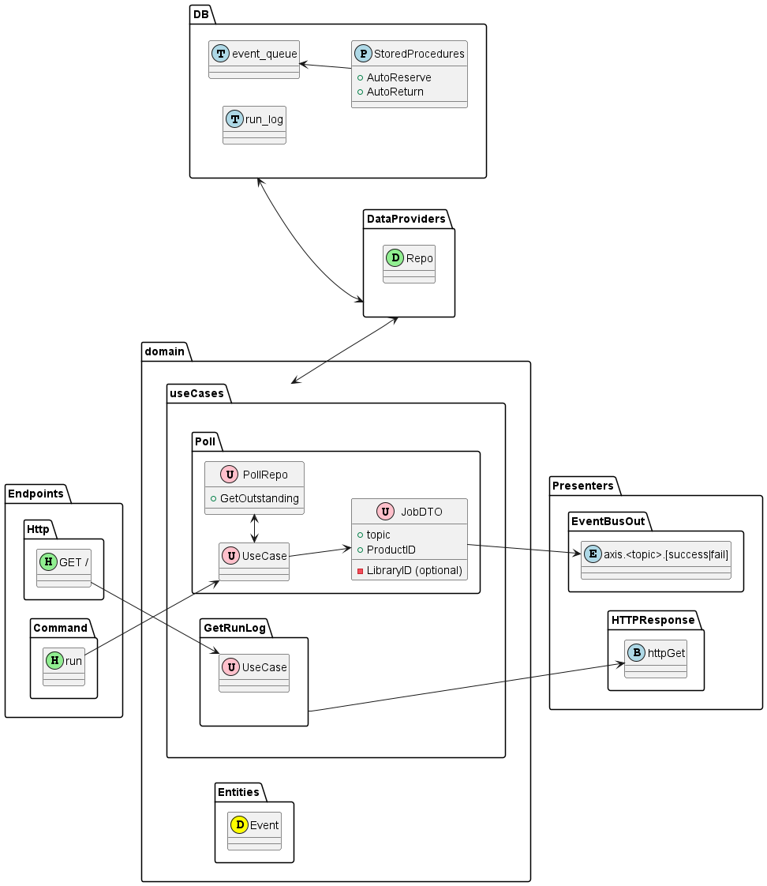

# Axis Poller

[[_TOC_]]

## Domain

(see [Domain Overview](axis-poller/domain.md))

A table will be added to take a queue, from which the poller will gather X records per run until no more remain, then it
will sleep. The records will be pushed straight into the event bus for processing by downstream services.

Existing batch processes will need to be modified to push their results into this queue table.

An alternative would be to have individual pollers building their own events based on the tables they're polling.
This would allow for accumulated changes to reduce the update frequency (e.g. if a book is checked out five times in five
minutes, we wouldn't need to queue five events, but would grab only the latest state wby the time the poller gets to it).

Whichever way the pollers work, we'll need to have a run-log to get the most recent run-time so we know which updated time
we're looking for.

## Endpoints

(see: [Endpoints](axis-poller/endpoints.md))

Axis Poller's primary endpoint will be a command execution which initiates the retrieval loop.

## Data Providers

(see: [Data Providers](axis-poller/data-providers.md))

## Architectural Overview

### Simplified

### Expoloded

