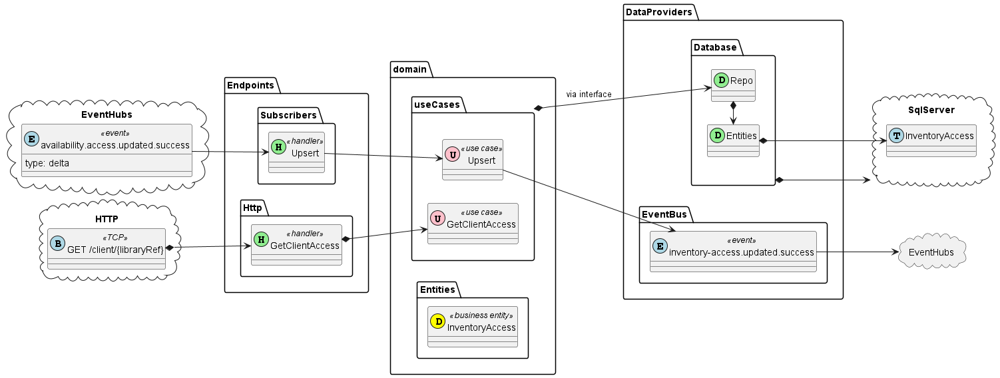

## Domain

(see [Domain Overview](inventory-access-service/domain.md))

Consortia consist of parent libraries and their children, who may also be their own parents.

Subscription services such as PPC will be treated as their own set of inventory. Libraries who subscribe to 
these services will search them using the same technique as a parent in a consortium.

Given these various access routes to an inventory item, it will be helpful to think of inventories more as collections
of titles available to a given entity. The majority of these entities will be libraries, but may be other things such as
subscription providers, or supra-library entities. The term LibraryID is currently being used as an alias for all such
entities, but this may change at some point.

A library may be a client of its own inventory. It may be a client of many other inventories (including its consortium
parent, and multiple subscription services). There may be a quota on clients, which stops them from checking out items
from a given inventory.

This service would exist as a lightweight way to maintain accurate inter-inventory access flags, for use with services
such as the search service, where we would need to reach out to find which inventories should be checked.

### Scenarios
In the following scenarios, Library A has access to five inventories: their own, their consortium parent, PPC, Bundle 1,
and Bundle 2. Green means available. Red means unavailable. Appearance in the "Title Service" box means they would 
show up in search results with the relevant availability flagged.

* **Full Availability**
  Their PPC budget has NOT been exceeded, and they are subscribed to Bundles 1 and 2. All titles have availability. 

  
* **Own Copy Unavailable**
  Title 1 has become unavailable under Library A's available quantity, but is still available under their Parent Library's
  available quantity.

  
* **Parent Copy Unavailable**
  Title 3, which is not directly "owned" by Library A has become unavailable under Parent Library's available quantity,
  but is part of PPC's inventory

  
* **Budget Exceeded**
  PPC Budget has been exceeded. Title 3 remains available because Library A has access via Parent Library's inventory.

  
* **Bundle Unsubscribed**
  Library A has opted not to continue subscribing to Bundle 1

  
## Endpoints

(see: [Endpoints](inventory-access-service/endpoints.md))

## Data Providers

(see: [Data Providers](inventory-access-service/data-providers.md))
The Inventory Access service will maintain its own persistence repository.

## Architectural Overview
### Structure
<pre>
.
├── Configuration
|   ├── App.cs
|   └── Configuration
|       ├── DatabaseConfiguration.cs
|       ├── EndpointConfiguration.cs
|       ├── EventBusConfiguration.cs
|       └── UseCaseConfiguration.cs
├── <a href="inventory-access-service/data-providers.md">DataProviders</a>
|   ├── <a href="inventory-access-service/data-providers.md#repository">Database</a>
|   |   ├── Entities
|   |   |   ├── InventoryAccess.cs
|   |   ├── Database.cs
|   └── <a href="inventory-access-service/data-providers.md#eventbus">EventBus</a>
|       └── EventBus.cs
├── <a href="inventory-access-service/domain.md">Domain</a>
|   ├── <a href="inventory-access-service/domain.md#entities">Entities</a>
|   |   ├── InventoryAccess.cs
|   └── <a href="inventory-access-service/domain.md#use-cases">UseCases</a>
|       ├── <a href="inventory-access-service/domain.md#get">GetClientAccess</a>
|       |   ├── IRepo.cs
|       |   ├── Request.cs
|       |   ├── Response.cs
|       |   └── UseCase
|       └── <a href="inventory-access-service/domain.md#upsert">Upsert</a>
|           ├── IRepo.cs
|           ├── IEventBus.cs
|           ├── Request.cs
|           ├── Response.cs
|           └── UseCase
├── <a href="inventory-access-service/endpoints.md">Endpoints</a>
    ├── Http
    |   ├── GetClientAccess
    |   |   ├── Endpoint.cs
    |   |   └── ResponseDTO.cs
    └── Subscribers
        └── Upsert
            ├── Event.cs
            └── SubscribeHandler.cs

</pre>

### Dependency and Data Flow

