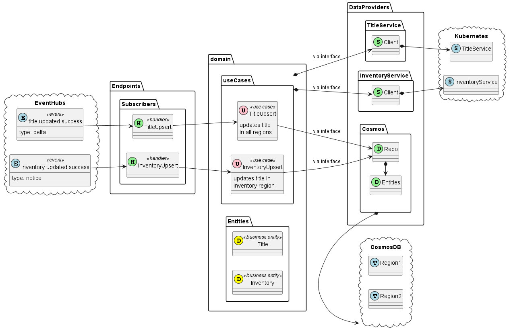

# Search ETL

[[_TOC_]]

## Domain

(see [Domain Overview](search-etl/domain.md))

The Search ETL domain handles stitching together of titles and availability data for
ingestion by Azure Cognitive Search.

## Endpoints

(see: [Endpoints](search-etl/endpoints.md))

Access to Search ETL use cases is primarily event based, as the service is intended to primarily be a transformer of data.

## Data Providers

(see: [Data Providers](search-etl/data-providers.md))
The Searh ETL service will maintain its own persistence repository. This will be a document store database.

## Architectural Overview
### Structure
<pre>
.
├── Configuration
|   ├── App.cs
|   └── Configuration
|       ├── DatabaseConfiguration.cs
|       ├── EndpointConfiguration.cs
|       ├── EventBusConfiguration.cs
|       └── UseCaseConfiguration.cs
├── <a href="search-etl/data-providers.md">DataProviders</a>
|   ├── <a href="search-etl/data-providers.md#repository">Database</a>
|   |   ├── Entities
|   |   |   ├── Search.cs
|   |   |   ├── BTAlias.cs
|   |   └── Database.cs
|   ├── <a href="search-etl/data-providers.md#inventory-service">InventoryService</a>
|   |   ├── Entities
|   |   |   ├── Inventory.cs
|   |   └── Client.cs
|   ├── <a href="search-etl/data-providers.md#title-service">TitleService</a>
|   |   ├── Entities
|   |   |   ├── Title.cs
|   |   └── Client.cs
├── <a href="search-etl/domain.md">Domain</a>
|   ├── <a href="search-etl/domain.md#entities">Entities</a>
|   |   └── SearchDocument.cs
|   └── <a href="search-etl/domain.md#use-cases">UseCases</a>
|       ├── <a href="search-etl/domain.md#get">TitleUpdate</a>
|       |   ├── IRepo.cs
|       |   ├── Request.cs
|       |   ├── Response.cs
|       |   └── UseCase
|       └── <a href="search-etl/domain.md#upsert">InventoryUpdate</a>
|           ├── IRepo.cs
|           ├── Request.cs
|           ├── Response.cs
|           └── UseCase
└── <a href="search-etl/endpoints.md">Endpoints</a>
    └── Subscribers
        ├── TItleUpdate
        |   ├── Event.cs
        |   └── SubscribeHandler.cs
        └── InventoryUpdate
            ├── Event.cs
            └── SubscribeHandler.cs
</pre>

### Dependency and Data Flow

