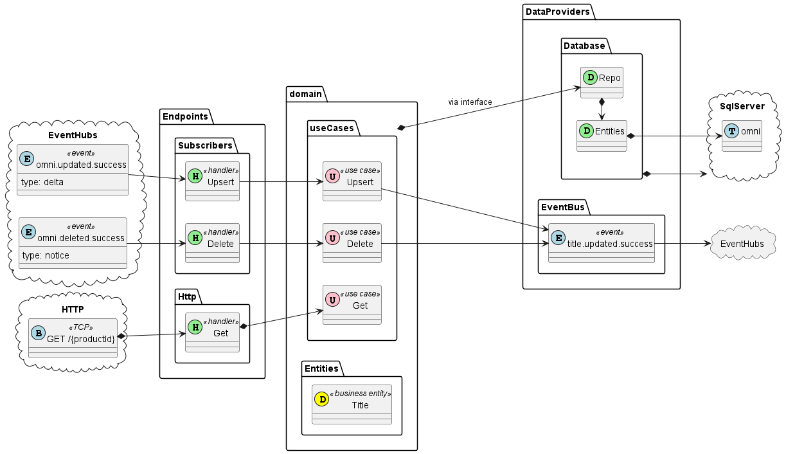

# Title ETL

[[_TOC_]]

## Domain

(see [Domain Overview](title-etl/domain.md))

The Title ETL service is intended to condense title data for use in other services (initially, and primarily,
[Search ETL](search-etl.md)).

The main purpose of condensing title data is to eliminate duplication due to (e.g.) BTKey variants and ISBN updates.

## Endpoints

(see: [Endpoints](title-etl/endpoints.md))

Access to Title use cases is primarily event based, as the service is intended to primarily be a transformer of data.
However, because of the ["notice event" pattern](../events/patterns.md) used by the majority of publishers, there must
be at least a GET endpoint.

Therefore, the Title ETL service has Event endpoints and REST endpoints.

## Data Providers

(see: [Data Providers](title-etl/data-providers.md))
The Title ETL service will maintain its own persistence repository. To enable efficient and extensible storage of
things like ISBN aliasing of products, this should be a relational database.

## Considerations

Given the design for this and the inventory service is serving more of a purpose than simple ETLs (see Get usecases)
this should be renamed title-service.

## Architectural Overview
### Structure
<pre>
.
├── Configuration
|   ├── App.cs
|   └── Configuration
|       ├── DatabaseConfiguration.cs
|       ├── EndpointConfiguration.cs
|       ├── EventBusConfiguration.cs
|       └── UseCaseConfiguration.cs
├── <a href="title-etl/data-providers.md">DataProviders</a>
|   ├── <a href="title-etl/data-providers.md#repository">Database</a>
|   |   ├── Entities
|   |   |   ├── Title.cs
|   |   |   ├── BTAlias.cs
|   |   ├── Database.cs
|   └── <a href="title-etl/data-providers.md#eventbus">EventBus</a>
|       └── EventBus.cs
├── <a href="title-etl/domain.md">Domain</a>
|   ├── <a href="title-etl/domain.md#entities">Entities</a>
|   |   ├── Title.cs
|   |   └── TitleShort.cs
|   └── <a href="title-etl/domain.md#use-cases">UseCases</a>
|       ├── <a href="./?wikiVersion=GBmaster&pagePath=/Solution/services/title-etl/domain?anchor=#delete">Delete</a>
|       |   ├── IRepo.cs
|       |   ├── IEventBus.cs
|       |   ├── Request.cs
|       |   ├── Response.cs
|       |   └── UseCase
|       ├── <a href="Boundless%20Search%20Design?wikiVersion=GBmaster&pagePath=/Solution/services/title-etl/domain?anchor=get">Get</a>
|       |   ├── IRepo.cs
|       |   ├── Request.cs
|       |   ├── Response.cs
|       |   └── UseCase
|       └── <a href="Boundless%20Search%20Design?wikiVersion=GBmaster&pagePath=/Solution/services/title-etl/domain?anchor=upsert">Upsert</a>
|           ├── IRepo.cs
|           ├── IEventBus.cs
|           ├── Request.cs
|           ├── Response.cs
|           └── UseCase
└── <a href="title-etl/endpoints.md">Endpoints</a>
    ├── Http
    |   ├── Get
    |   |   ├── Endpoint.cs
    |   |   └── ResponseDTO.cs
    └── Subscribers
        ├── Delete
        |   ├── Event.cs
        |   └── SubscribeHandler.cs
        └── Upsert
            ├── Event.cs
            └── SubscribeHandler.cs

</pre>
### Dependency and Data Flow
